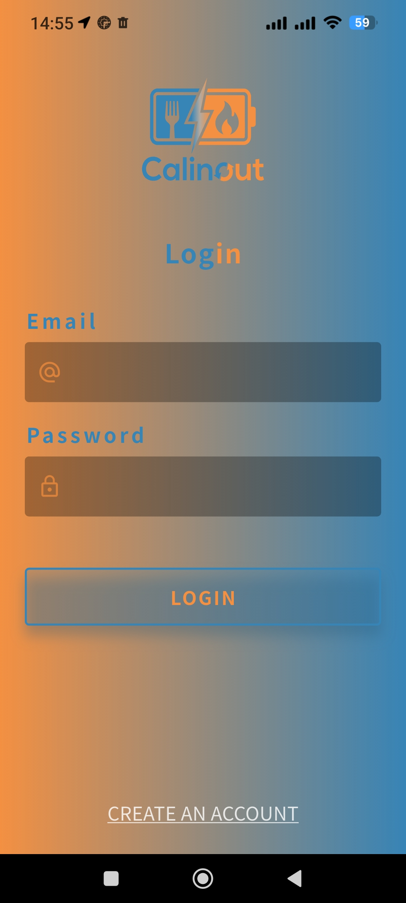
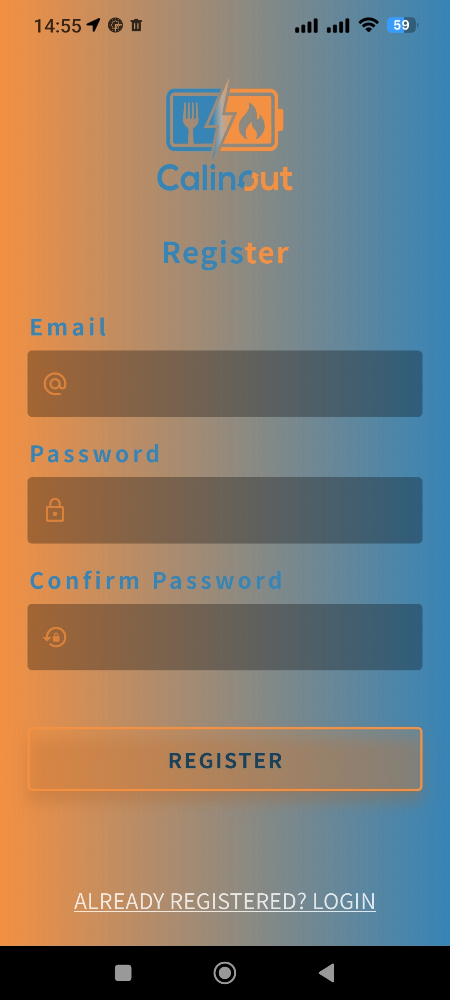
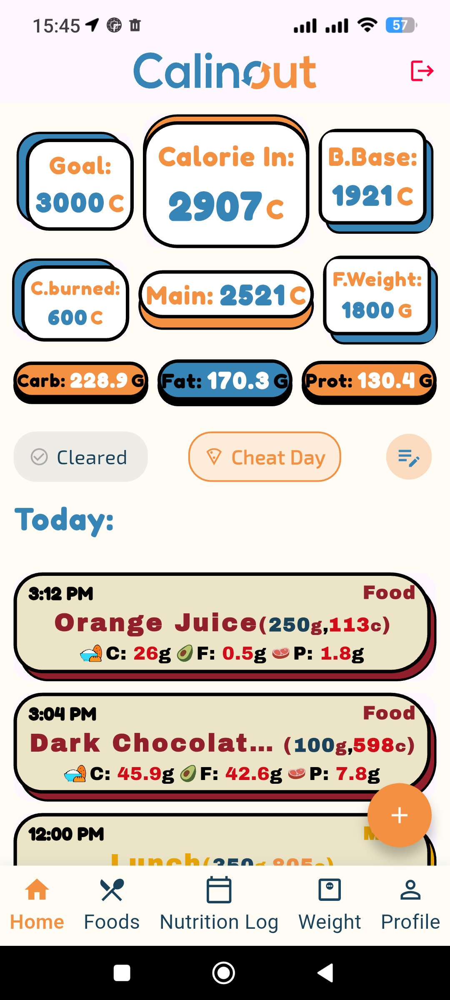
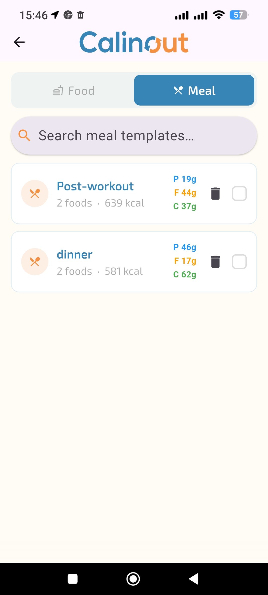
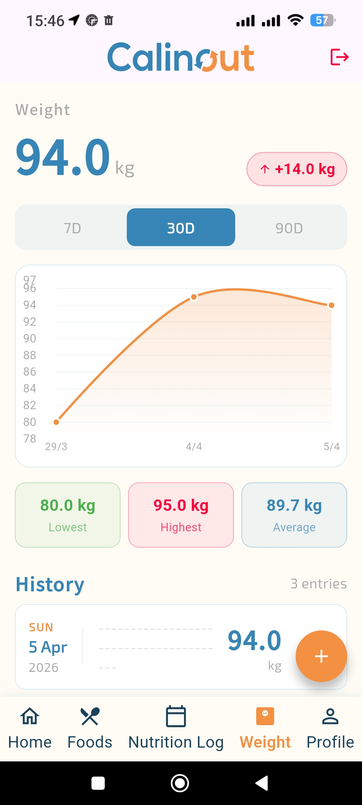

# Calinout Flutter App

A mobile calorie and nutrition tracking app built with Flutter,
connected to a live ASP.NET Core API.

[Back-end Repo](https://github.com/predaxmh/calinout-api)

[Live API / Swagger](https://api-calinout-isl-hfgnhvhqazfjfcfd.francecentral-01.azurewebsites.net/swagger/index.html)(For test only, give it 60 seconds to wake up on the first call)

<p float="left">

  
  
  
  
  
  
  
</p>

# Features

- JWT authentication with automatic token refresh via Dio interceptor —
  the user is never interrupted when the access token expires
- Secure token storage using Flutter Secure Storage
- Route protection with GoRouter — unauthenticated users are
  redirected to login automatically
- State management with Riverpod — loading, error, and data states
  handled consistently across all screens
- Paginated responses for food history
- Layered architecture — swapping the API client requires
  changing only the data layer
- Structured logging with Talker
- Responsive layout — adapts to different screen sizes

## Architecture

- The project has two main folders **/core** and **/features**
  **Core** holds everything shared across features:
- `/config` — GoRouter setup, routes, and AppConfig (flutter_dotenv)
- `/networking` — Dio client and interceptors
- `/database` — Hive configuration for local storage
- `/logger` — Talker configuration
- Shared widgets, models, and utilities

- **Features**: separated into three layers:

**Data Layer**

- API service (Dio calls)
- Data source interface
- Repository implementation
- DTOs

**Domain Layer**

- Business entities
- Repository interfaces

**Presentation Layer**

- Riverpod controllers (state)
- Pages (UI)

**Operations flow :**
ASP.NET API
↕ JSON / HTTP
API Service (Data Layer)
↕ DTO
Repository Implementation
↕ Result<T> / Entity
Riverpod Controller
↕ State / Entity
Page (UI)

**Authentication flow:**

**Login/Register**:

→ Success: access token + refresh token
stored in Flutter Secure Storage
→ GoRouter redirects to Home

→ Failure: error state
→ GoRouter stays on Login

- When the access token expires, the **Dio interceptor** automatically
  uses the refresh token to get a new one — no manual re-login required.

## Tech Stack

- Framework | Flutter 3 |
- State Management | Riverpod |
- HTTP Client | Dio |
- Testing | Flutter Test (unit) |
- Routing | GoRoute|
- Logger | Talker|

## Getting Started

### Prerequisites

- Flutter 3 SDK
- A running instance of the
  [Calinout API](https://github.com/predaxmh/calinout-api)

### Setup

**1. Clone the repository:**

```bash
git clone https://github.com/predaxmh/calinout-flutter.git
cd calinout-flutter
flutter pub get

```

**Important:** don't forget to generate files run:

```
dart run build_runner build --delete-conflicting-outputs>
```

**2. Create a `.env` file at the project root:**

**Note**: you need to run the asp.net api(link above),and copy local **.env**, or use the cloud .env code.(cloud is for limited time)

**Cloud**

```
API_BASE_URL=https://api-calinout-isl-hfgnhvhqazfjfcfd.francecentral-01.azurewebsites.net
APP_ENV=dev
ENABLE_LOGGING=true
```

**local(running the back-end Api)**

```
API_BASE_URL=https://10.0.2.2:7026
APP_ENV=dev
ENABLE_LOGGING=true
```

## Known Limitations & Reflections

- This app is a functional MVP but isn't production-ready yet.
- I haven't done a full widget performance yet (const constructors, unnecessary rebuilds, local font bundling) My goal was to demonstrate the core architecture and data flow

- I used AI to assist with specific UI components, such as the Weight Screen. While AI helped with the initial layout, I manually reviewed and integrated the code to ensure I fully understand the implementation.

- I chose not to spend time configuring the test environment for
  integration and widget tests — the patterns are the same and
  I understand them, but it wasn't worth the time for a portfolio project.
